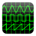

#  Signal Generator   

A signal generator for Android. The app can be downloaded from [F-Droid](https://f-droid.org/packages/org.billthefarmer.siggen)
and [here](https://github.com/billthefarmer/sig-gen/releases).

 *  Frequency range 0.1Hz - 25KHz
 *  Level range 0dB - -80dB
 *  Set exact frequency
 *  Frequency bookmarks

### Using
The frequency knob responds to finger twirling. The fine frequency and
level sliders allow for fine adjustments of frequency and output
level. The frequency knob is also adjustable using the left and right
arrow buttons above. The two bookmark buttons below the frequency knob
show if there are bookmarks, and will go to the next lower or higher
bookmark if it exists.

The toolbar items are, from left to right:
 * **Exact** - Prompt for an exact frequency
 * **Bookmark** - Save the current frequency as a bookmark
 * **Sleep** - Prevent the device from sleeping
 * **Settings** - Show the settings.
 
To remove a bookmark, go to it and touch the toolbar bookmark button.
